# Sequence diagrams (Mermaid)

Tai lieu nay tong hop sequence diagram cho cac chuc nang da thay trong source code hien tai cua `C-SA-T` va `VinhKhanh`.

Luu y:
- Cac so do ben duoi bam theo code dang co, khong bam theo phan PRD chua duoc implement.
- Cac chuc nang chua thay code day du: dang ky tai khoan, subscription/payment, email notification, upload anh gian hang.

## 1. Dang nhap va phan luong vao app

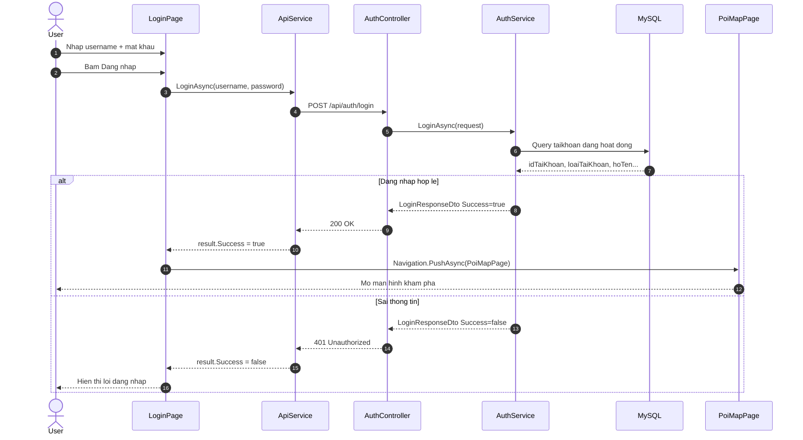
```mermaid
sequenceDiagram
    autonumber
    actor User
    participant LoginPage as LoginPage
    participant Api as ApiService
    participant AuthCtl as AuthController
    participant AuthSvc as AuthService
    participant DB as MySQL
    participant PoiMap as PoiMapPage

    User->>LoginPage: Nhap username + mat khau
    User->>LoginPage: Bam Dang nhap
    LoginPage->>Api: LoginAsync(username, password)
    Api->>AuthCtl: POST /api/auth/login
    AuthCtl->>AuthSvc: LoginAsync(request)
    AuthSvc->>DB: Query taikhoan dang hoat dong
    DB-->>AuthSvc: idTaiKhoan, loaiTaiKhoan, hoTen...

    alt Dang nhap hop le
        AuthSvc-->>AuthCtl: LoginResponseDto Success=true
        AuthCtl-->>Api: 200 OK
        Api-->>LoginPage: result.Success = true
        LoginPage->>PoiMap: Navigation.PushAsync(PoiMapPage)
        PoiMap-->>User: Mo man hinh kham pha
    else Sai thong tin
        AuthSvc-->>AuthCtl: LoginResponseDto Success=false
        AuthCtl-->>Api: 401 Unauthorized
        Api-->>LoginPage: result.Success = false
        LoginPage-->>User: Hien thi loi dang nhap
    end
```

## 17. Xem tour trên app và khởi chạy tour

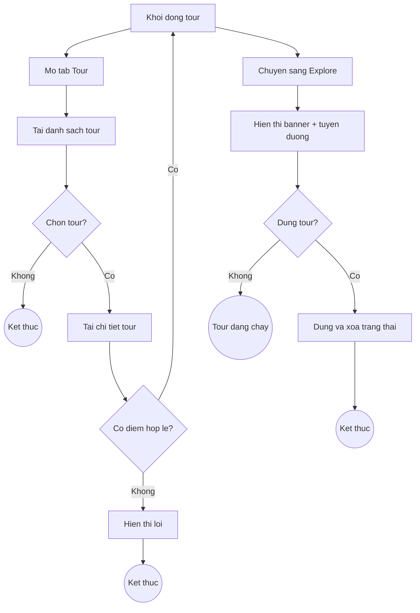
```mermaid
flowchart TD
    Start((Bat dau)) --> OpenTab["Mo tab Tour"]
    OpenTab --> LoadTours["Tai danh sach tour"]
    LoadTours --> Select{"Chon tour?"}
    
    Select -- Khong --> End1((Ket thuc))
    Select -- Co --> LoadDetail["Tai chi tiet tour"]
    LoadDetail --> Validate{"Co diem hop le?"}
    
    Validate -- Khong --> Error["Hien thi loi"]
    Error --> End2((Ket thuc))
    
    Validate -- Co --> Start["Khoi dong tour"]
    Start --> Explore["Chuyen sang Explore"]
    Explore --> Banner["Hien thi banner + tuyen duong"]
    Banner --> Running{"Dung tour?"}
    
    Running -- Co --> Stop["Dung va xoa trang thai"]
    Stop --> End3((Ket thuc))
    
    Running -- Khong --> End4((Tour dang chay))
```

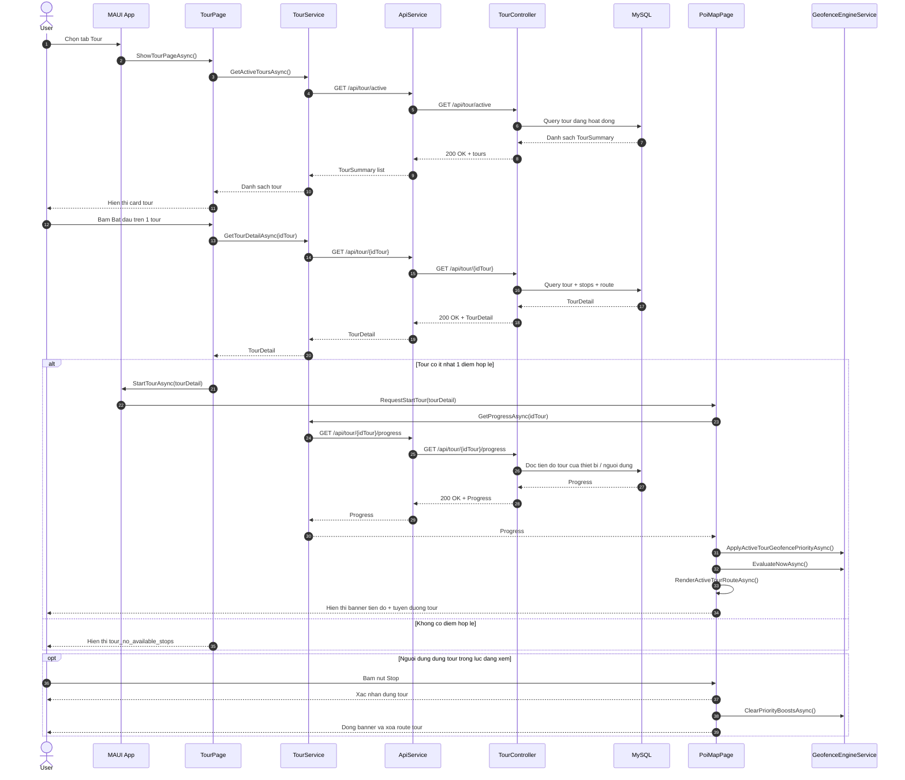
```mermaid
sequenceDiagram
    autonumber
    actor User
    participant App as MAUI App
    participant TourPage as TourPage
    participant TourSvc as TourService
    participant Api as ApiService
    participant TourCtl as TourController
    participant DB as MySQL
    participant Explore as PoiMapPage
    participant Geofence as GeofenceEngineService

    User->>App: Chọn tab Tour
    App->>TourPage: ShowTourPageAsync()
    TourPage->>TourSvc: GetActiveToursAsync()
    TourSvc->>Api: GET /api/tour/active
    Api->>TourCtl: GET /api/tour/active
    TourCtl->>DB: Query tour dang hoat dong
    DB-->>TourCtl: Danh sach TourSummary
    TourCtl-->>Api: 200 OK + tours
    Api-->>TourSvc: TourSummary list
    TourSvc-->>TourPage: Danh sach tour
    TourPage-->>User: Hien thi card tour

    User->>TourPage: Bam Bat dau tren 1 tour
    TourPage->>TourSvc: GetTourDetailAsync(idTour)
    TourSvc->>Api: GET /api/tour/{idTour}
    Api->>TourCtl: GET /api/tour/{idTour}
    TourCtl->>DB: Query tour + stops + route
    DB-->>TourCtl: TourDetail
    TourCtl-->>Api: 200 OK + TourDetail
    Api-->>TourSvc: TourDetail
    TourSvc-->>TourPage: TourDetail

    alt Tour co it nhat 1 diem hop le
        TourPage->>App: StartTourAsync(tourDetail)
        App->>Explore: RequestStartTour(tourDetail)
        Explore->>TourSvc: GetProgressAsync(idTour)
        TourSvc->>Api: GET /api/tour/{idTour}/progress
        Api->>TourCtl: GET /api/tour/{idTour}/progress
        TourCtl->>DB: Doc tien do tour cua thiet bi / nguoi dung
        DB-->>TourCtl: Progress
        TourCtl-->>Api: 200 OK + Progress
        Api-->>TourSvc: Progress
        TourSvc-->>Explore: Progress
        Explore->>Geofence: ApplyActiveTourGeofencePriorityAsync()
        Explore->>Geofence: EvaluateNowAsync()
        Explore->>Explore: RenderActiveTourRouteAsync()
        Explore-->>User: Hien thi banner tien do + tuyen duong tour
    else Khong co diem hop le
        TourPage-->>User: Hien thi tour_no_available_stops
    end

    opt Nguoi dung dung tour trong luc dang xem
        User->>Explore: Bam nut Stop
        Explore-->>User: Xac nhan dung tour
        Explore->>Geofence: ClearPriorityBoostsAsync()
        Explore-->>User: Dong banner va xoa route tour
    end
```

```mermaid
flowchart TD
    Start((Bắt đầu)) --> OpenTab["Mở tab Tour"]
    OpenTab --> LoadTours["Tải danh sách tour"]
    LoadTours --> Select{"Chọn tour?"}
    
    Select -- Không --> End1((Kết thúc))
    Select -- Có --> LoadDetail["Tải chi tiết tour"]
    LoadDetail --> Validate{"Có điểm hợp lệ?"}
    
    Validate -- Không --> Error["Hiển thị lỗi"]
    Error --> End2((Kết thúc))
    
    Validate -- Có --> Start["Khởi động tour"]
    Start --> Explore["Chuyển sang Explore"]
    Explore --> Banner["Hiển thị banner + tuyến đường"]
    Banner --> Running{"Dừng tour?"}
    
    Running -- Có --> Stop["Dừng và xóa trạng thái"]
    Stop --> End3((Kết thúc))
    
    Running -- Không --> End4((Tour đang chạy))
```

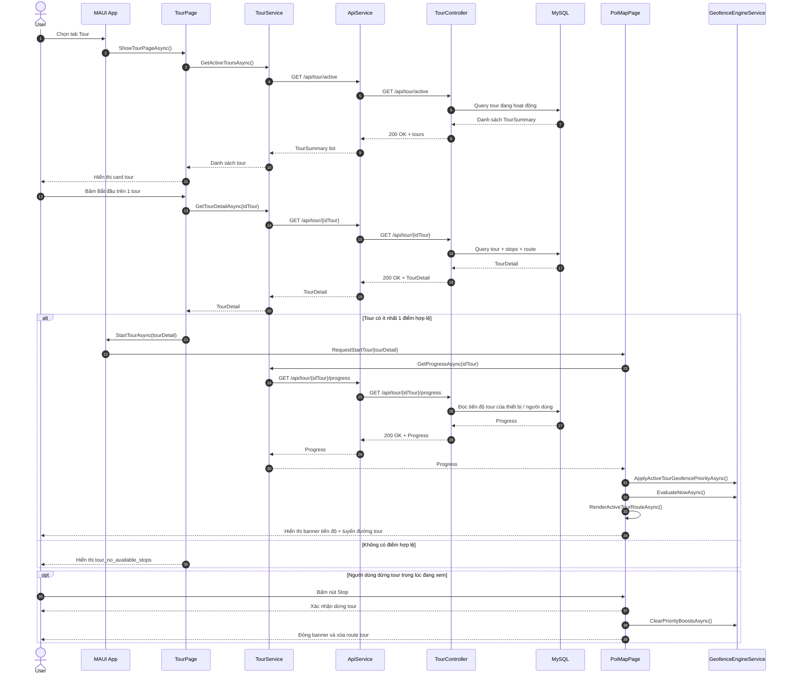
```mermaid
sequenceDiagram
    autonumber
    actor User
    participant App as MAUI App
    participant TourPage as TourPage
    participant TourSvc as TourService
    participant Api as ApiService
    participant TourCtl as TourController
    participant DB as MySQL
    participant Explore as PoiMapPage
    participant Geofence as GeofenceEngineService

    User->>App: Chọn tab Tour
    App->>TourPage: ShowTourPageAsync()
    TourPage->>TourSvc: GetActiveToursAsync()
    TourSvc->>Api: GET /api/tour/active
    Api->>TourCtl: GET /api/tour/active
    TourCtl->>DB: Query tour đang hoạt động
    DB-->>TourCtl: Danh sách TourSummary
    TourCtl-->>Api: 200 OK + tours
    Api-->>TourSvc: TourSummary list
    TourSvc-->>TourPage: Danh sách tour
    TourPage-->>User: Hiển thị card tour

    User->>TourPage: Bấm Bắt đầu trên 1 tour
    TourPage->>TourSvc: GetTourDetailAsync(idTour)
    TourSvc->>Api: GET /api/tour/{idTour}
    Api->>TourCtl: GET /api/tour/{idTour}
    TourCtl->>DB: Query tour + stops + route
    DB-->>TourCtl: TourDetail
    TourCtl-->>Api: 200 OK + TourDetail
    Api-->>TourSvc: TourDetail
    TourSvc-->>TourPage: TourDetail

    alt Tour có ít nhất 1 điểm hợp lệ
        TourPage->>App: StartTourAsync(tourDetail)
        App->>Explore: RequestStartTour(tourDetail)
        Explore->>TourSvc: GetProgressAsync(idTour)
        TourSvc->>Api: GET /api/tour/{idTour}/progress
        Api->>TourCtl: GET /api/tour/{idTour}/progress
        TourCtl->>DB: Đọc tiến độ tour của thiết bị / người dùng
        DB-->>TourCtl: Progress
        TourCtl-->>Api: 200 OK + Progress
        Api-->>TourSvc: Progress
        TourSvc-->>Explore: Progress
        Explore->>Geofence: ApplyActiveTourGeofencePriorityAsync()
        Explore->>Geofence: EvaluateNowAsync()
        Explore->>Explore: RenderActiveTourRouteAsync()
        Explore-->>User: Hiển thị banner tiến độ + tuyến đường tour
    else Không có điểm hợp lệ
        TourPage-->>User: Hiển thị tour_no_available_stops
    end

    opt Người dùng dừng tour trong lúc đang xem
        User->>Explore: Bấm nút Stop
        Explore-->>User: Xác nhận dừng tour
        Explore->>Geofence: ClearPriorityBoostsAsync()
        Explore-->>User: Đóng banner và xóa route tour
    end
```

## 18. Sequence thanh toán online và giá trị trả về

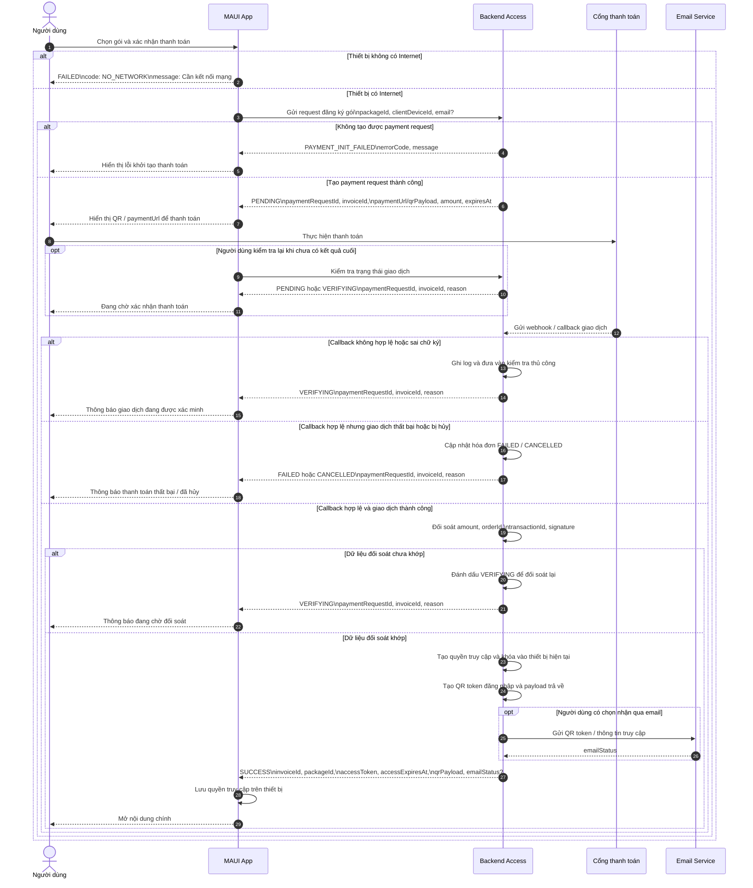
```mermaid
sequenceDiagram
    autonumber
    actor User as Người dùng
    participant App as MAUI App
    participant API as Backend Access
    participant Pay as Cổng thanh toán
    participant Mail as Email Service

    User->>App: Chọn gói và xác nhận thanh toán

    alt Thiết bị không có Internet
        App-->>User: FAILED\ncode: NO_NETWORK\nmessage: Cần kết nối mạng
    else Thiết bị có Internet
        App->>API: Gửi request đăng ký gói\npackageId, clientDeviceId, email?

        alt Không tạo được payment request
            API-->>App: PAYMENT_INIT_FAILED\nerrorCode, message
            App-->>User: Hiển thị lỗi khởi tạo thanh toán
        else Tạo payment request thành công
            API-->>App: PENDING\npaymentRequestId, invoiceId,\npaymentUrl/qrPayload, amount, expiresAt
            App-->>User: Hiển thị QR / paymentUrl để thanh toán
            User->>Pay: Thực hiện thanh toán

            opt Người dùng kiểm tra lại khi chưa có kết quả cuối
                App->>API: Kiểm tra trạng thái giao dịch
                API-->>App: PENDING hoặc VERIFYING\npaymentRequestId, invoiceId, reason
                App-->>User: Đang chờ xác nhận thanh toán
            end

            Pay-->>API: Gửi webhook / callback giao dịch

            alt Callback không hợp lệ hoặc sai chữ ký
                API->>API: Ghi log và đưa vào kiểm tra thủ công
                API-->>App: VERIFYING\npaymentRequestId, invoiceId, reason
                App-->>User: Thông báo giao dịch đang được xác minh

            else Callback hợp lệ nhưng giao dịch thất bại hoặc bị hủy
                API->>API: Cập nhật hóa đơn FAILED / CANCELLED
                API-->>App: FAILED hoặc CANCELLED\npaymentRequestId, invoiceId, reason
                App-->>User: Thông báo thanh toán thất bại / đã hủy

            else Callback hợp lệ và giao dịch thành công
                API->>API: Đối soát amount, orderId,\ntransactionId, signature

                alt Dữ liệu đối soát chưa khớp
                    API->>API: Đánh dấu VERIFYING để đối soát lại
                    API-->>App: VERIFYING\npaymentRequestId, invoiceId, reason
                    App-->>User: Thông báo đang chờ đối soát

                else Dữ liệu đối soát khớp
                    API->>API: Tạo quyền truy cập và khóa vào thiết bị hiện tại
                    API->>API: Tạo QR token đăng nhập và payload trả về

                    opt Người dùng có chọn nhận qua email
                        API->>Mail: Gửi QR token / thông tin truy cập
                        Mail-->>API: emailStatus
                    end

                    API-->>App: SUCCESS\ninvoiceId, packageId,\naccessToken, accessExpiresAt,\nqrPayload, emailStatus?
                    App->>App: Lưu quyền truy cập trên thiết bị
                    App-->>User: Mở nội dung chính
                end
            end
        end
    end
```

## 2. Tai AppData va cache offline

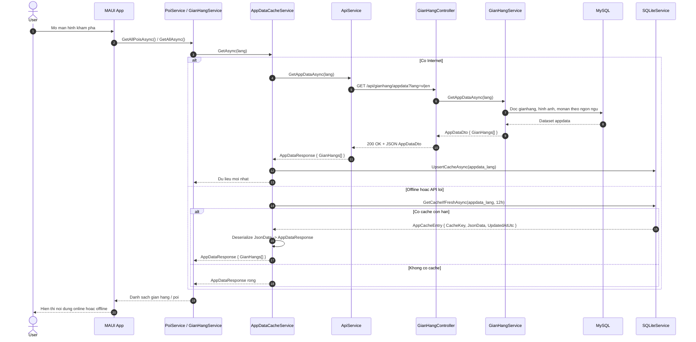
```mermaid
sequenceDiagram
    autonumber
    actor User
    participant App as MAUI App
    participant PoiSvc as PoiService / GianHangService
    participant Cache as AppDataCacheService
    participant Api as ApiService
    participant GianHangCtl as GianHangController
    participant GianHangSvc as GianHangService
    participant DB as MySQL
    participant SQLite as SQLiteService

    User->>App: Mo man hinh kham pha
    App->>PoiSvc: GetAllPoisAsync() / GetAllAsync()
    PoiSvc->>Cache: GetAsync(lang)

    alt Co Internet
        Cache->>Api: GetAppDataAsync(lang)
        Api->>GianHangCtl: GET /api/gianhang/appdata?lang=vi|en
        GianHangCtl->>GianHangSvc: GetAppDataAsync(lang)
        GianHangSvc->>DB: Doc gianhang, hinh anh, monan theo ngon ngu
        DB-->>GianHangSvc: Dataset appdata
        GianHangSvc-->>GianHangCtl: AppDataDto { GianHangs[] }
        GianHangCtl-->>Api: 200 OK + JSON AppDataDto
        Api-->>Cache: AppDataResponse { GianHangs[] }
        Cache->>SQLite: UpsertCacheAsync(appdata_lang)
        Cache-->>PoiSvc: Du lieu moi nhat
    else Offline hoac API loi
        Cache->>SQLite: GetCacheIfFreshAsync(appdata_lang, 12h)
        alt Co cache con han
            SQLite-->>Cache: AppCacheEntry { CacheKey, JsonData, UpdatedAtUtc }
            Cache->>Cache: Deserialize JsonData -> AppDataResponse
            Cache-->>PoiSvc: AppDataResponse { GianHangs[] }
        else Khong co cache
            Cache-->>PoiSvc: AppDataResponse rong
        end
    end

    PoiSvc-->>App: Danh sach gian hang / poi
    App-->>User: Hien thi noi dung online hoac offline
```

## 3. Tim kiem POI va mo chi tiet

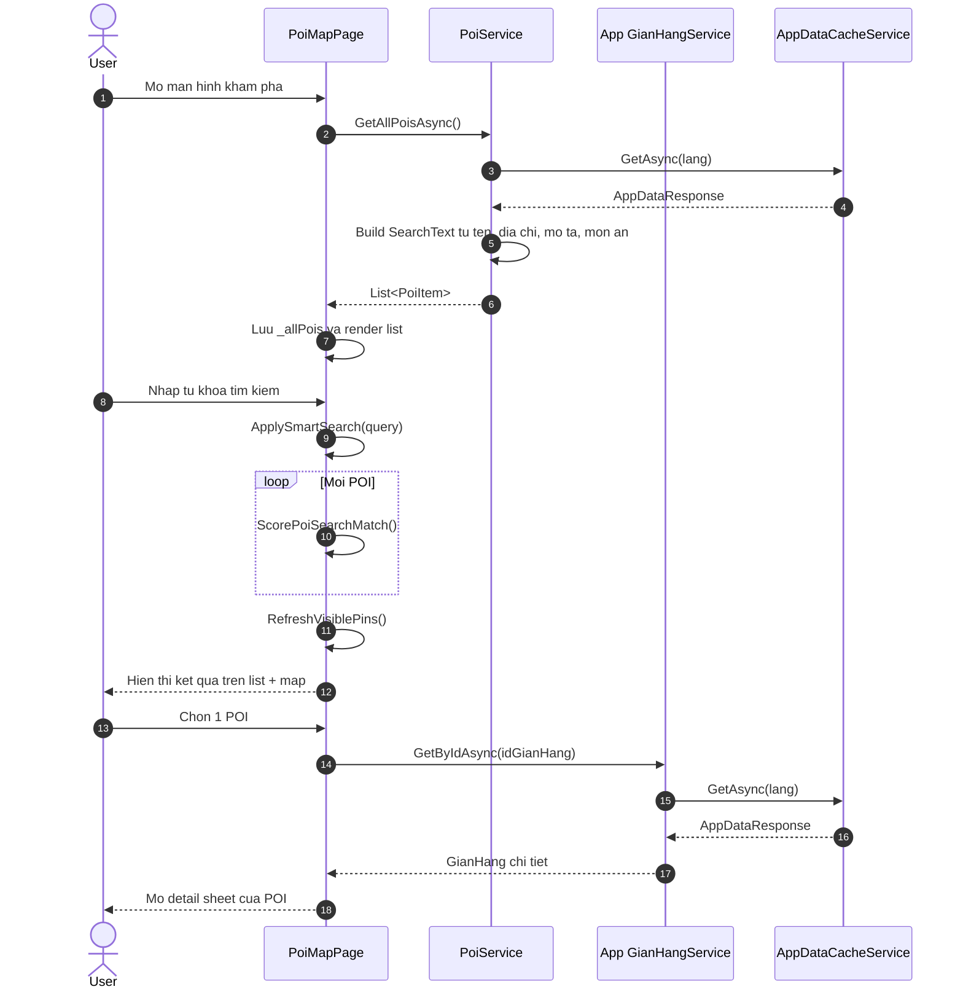
```mermaid
sequenceDiagram
    autonumber
    actor User
    participant PoiMap as PoiMapPage
    participant PoiSvc as PoiService
    participant GianHangSvc as App GianHangService
    participant Cache as AppDataCacheService

    User->>PoiMap: Mo man hinh kham pha
    PoiMap->>PoiSvc: GetAllPoisAsync()
    PoiSvc->>Cache: GetAsync(lang)
    Cache-->>PoiSvc: AppDataResponse
    PoiSvc->>PoiSvc: Build SearchText tu ten, dia chi, mo ta, mon an
    PoiSvc-->>PoiMap: List<PoiItem>
    PoiMap->>PoiMap: Luu _allPois va render list

    User->>PoiMap: Nhap tu khoa tim kiem
    PoiMap->>PoiMap: ApplySmartSearch(query)
    loop Moi POI
        PoiMap->>PoiMap: ScorePoiSearchMatch()
    end
    PoiMap->>PoiMap: RefreshVisiblePins()
    PoiMap-->>User: Hien thi ket qua tren list + map

    User->>PoiMap: Chon 1 POI
    PoiMap->>GianHangSvc: GetByIdAsync(idGianHang)
    GianHangSvc->>Cache: GetAsync(lang)
    Cache-->>GianHangSvc: AppDataResponse
    GianHangSvc-->>PoiMap: GianHang chi tiet
    PoiMap-->>User: Mo detail sheet cua POI
```

## 4. Geofence va tu dong phat audio

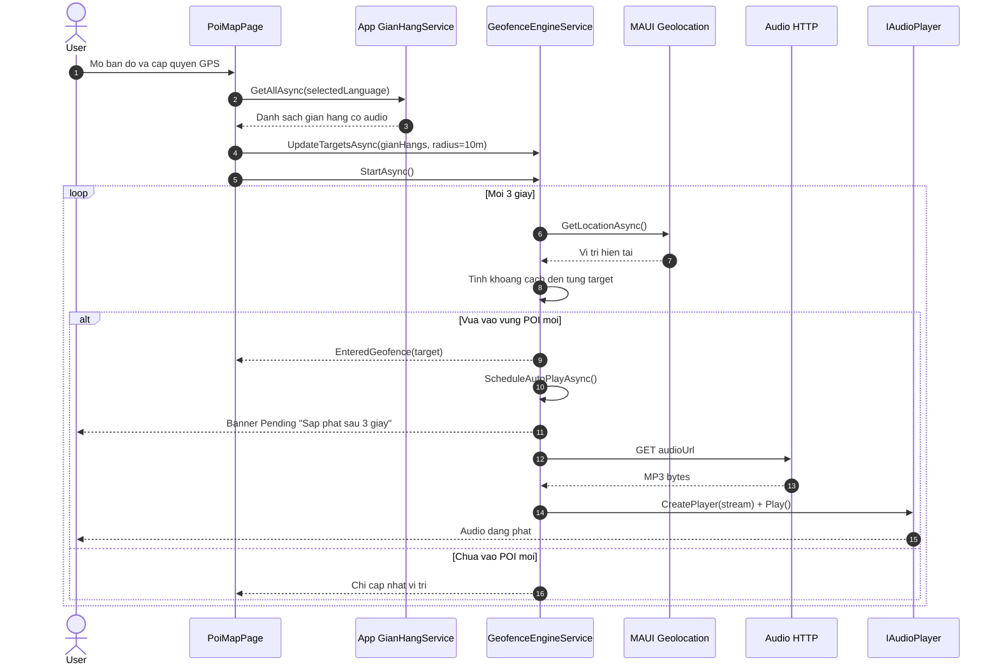
```mermaid
sequenceDiagram
    autonumber
    actor User
    participant PoiMap as PoiMapPage
    participant GianHangSvc as App GianHangService
    participant Geofence as GeofenceEngineService
    participant GPS as MAUI Geolocation
    participant AudioHttp as Audio HTTP
    participant Player as IAudioPlayer

    User->>PoiMap: Mo ban do va cap quyen GPS
    PoiMap->>GianHangSvc: GetAllAsync(selectedLanguage)
    GianHangSvc-->>PoiMap: Danh sach gian hang co audio
    PoiMap->>Geofence: UpdateTargetsAsync(gianHangs, radius=10m)
    PoiMap->>Geofence: StartAsync()

    loop Moi 3 giay
        Geofence->>GPS: GetLocationAsync()
        GPS-->>Geofence: Vi tri hien tai
        Geofence->>Geofence: Tinh khoang cach den tung target

        alt Vua vao vung POI moi
            Geofence-->>PoiMap: EnteredGeofence(target)
            Geofence->>Geofence: ScheduleAutoPlayAsync()
            Geofence-->>User: Banner Pending "Sap phat sau 3 giay"
            Geofence->>AudioHttp: GET audioUrl
            AudioHttp-->>Geofence: MP3 bytes
            Geofence->>Player: CreatePlayer(stream) + Play()
            Player-->>User: Audio dang phat
        else Chua vao POI moi
            Geofence-->>PoiMap: Chi cap nhat vi tri
        end
    end
```

## 5. Chuyen ngon ngu trong chi tiet POI

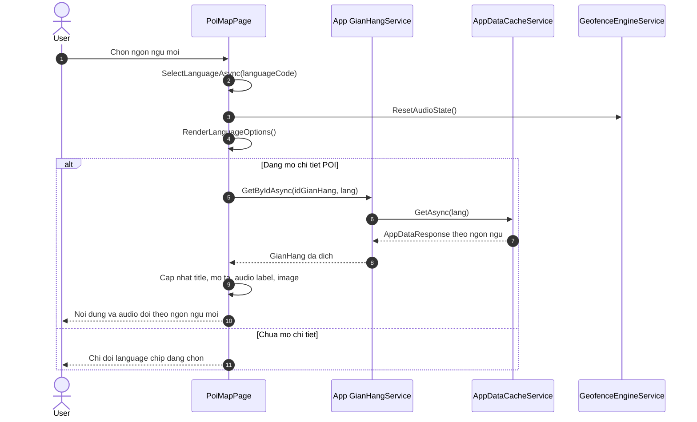
```mermaid
sequenceDiagram
    autonumber
    actor User
    participant PoiMap as PoiMapPage
    participant GianHangSvc as App GianHangService
    participant Cache as AppDataCacheService
    participant Geofence as GeofenceEngineService

    User->>PoiMap: Chon ngon ngu moi
    PoiMap->>PoiMap: SelectLanguageAsync(languageCode)
    PoiMap->>Geofence: ResetAudioState()
    PoiMap->>PoiMap: RenderLanguageOptions()

    alt Dang mo chi tiet POI
        PoiMap->>GianHangSvc: GetByIdAsync(idGianHang, lang)
        GianHangSvc->>Cache: GetAsync(lang)
        Cache-->>GianHangSvc: AppDataResponse theo ngon ngu
        GianHangSvc-->>PoiMap: GianHang da dich
        PoiMap->>PoiMap: Cap nhat title, mo ta, audio label, image
        PoiMap-->>User: Noi dung va audio doi theo ngon ngu moi
    else Chua mo chi tiet
        PoiMap-->>User: Chi doi language chip dang chon
    end
```

## 6. Quet QR va tao phien truy cap

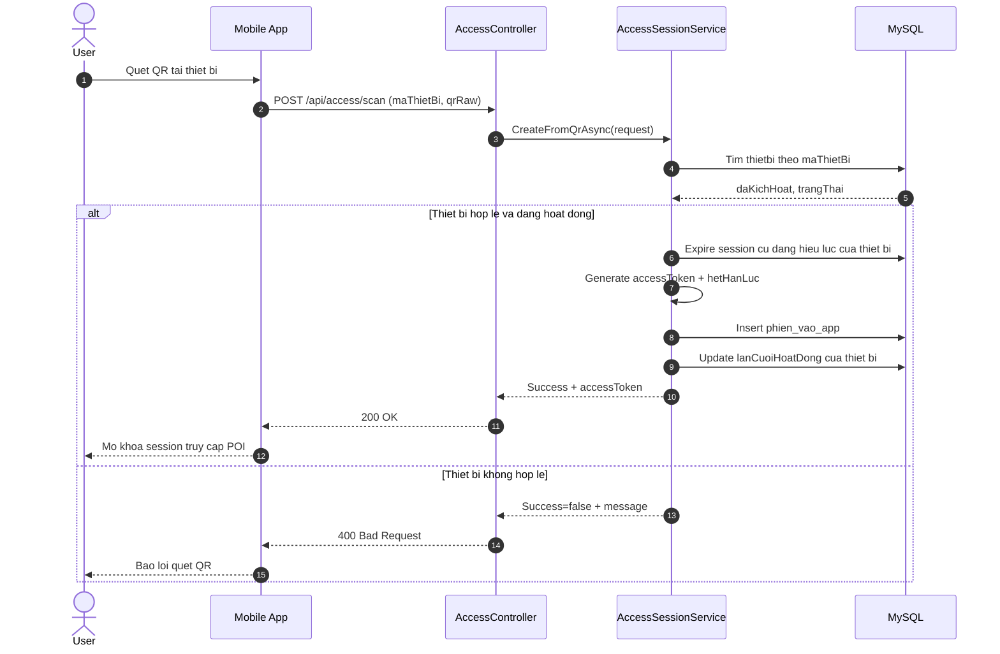
```mermaid
sequenceDiagram
    autonumber
    actor User
    participant App as Mobile App
    participant AccessCtl as AccessController
    participant AccessSvc as AccessSessionService
    participant DB as MySQL

    User->>App: Quet QR tai thiet bi
    App->>AccessCtl: POST /api/access/scan (maThietBi, qrRaw)
    AccessCtl->>AccessSvc: CreateFromQrAsync(request)
    AccessSvc->>DB: Tim thietbi theo maThietBi
    DB-->>AccessSvc: daKichHoat, trangThai

    alt Thiet bi hop le va dang hoat dong
        AccessSvc->>DB: Expire session cu dang hieu luc cua thiet bi
        AccessSvc->>AccessSvc: Generate accessToken + hetHanLuc
        AccessSvc->>DB: Insert phien_vao_app
        AccessSvc->>DB: Update lanCuoiHoatDong cua thiet bi
        AccessSvc-->>AccessCtl: Success + accessToken
        AccessCtl-->>App: 200 OK
        App-->>User: Mo khoa session truy cap POI
    else Thiet bi khong hop le
        AccessSvc-->>AccessCtl: Success=false + message
        AccessCtl-->>App: 400 Bad Request
        App-->>User: Bao loi quet QR
    end
```

## 7. Validate access token

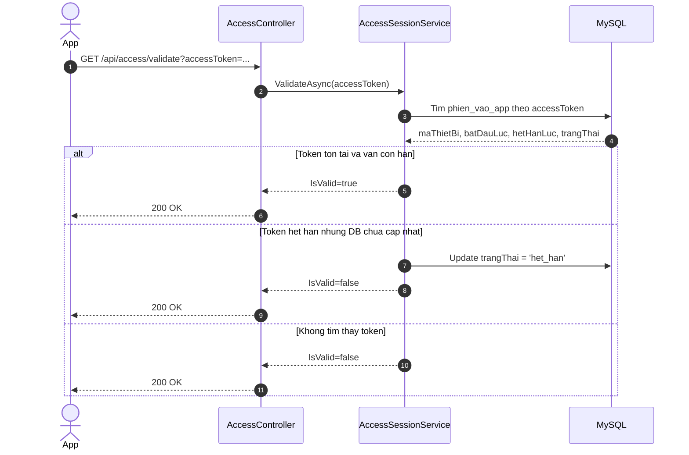
```mermaid
sequenceDiagram
    autonumber
    actor App
    participant AccessCtl as AccessController
    participant AccessSvc as AccessSessionService
    participant DB as MySQL

    App->>AccessCtl: GET /api/access/validate?accessToken=...
    AccessCtl->>AccessSvc: ValidateAsync(accessToken)
    AccessSvc->>DB: Tim phien_vao_app theo accessToken
    DB-->>AccessSvc: maThietBi, batDauLuc, hetHanLuc, trangThai

    alt Token ton tai va van con han
        AccessSvc-->>AccessCtl: IsValid=true
        AccessCtl-->>App: 200 OK
    else Token het han nhung DB chua cap nhat
        AccessSvc->>DB: Update trangThai = 'het_han'
        AccessSvc-->>AccessCtl: IsValid=false
        AccessCtl-->>App: 200 OK
    else Khong tim thay token
        AccessSvc-->>AccessCtl: IsValid=false
        AccessCtl-->>App: 200 OK
    end
```

## 8. Kich hoat thiet bi QR

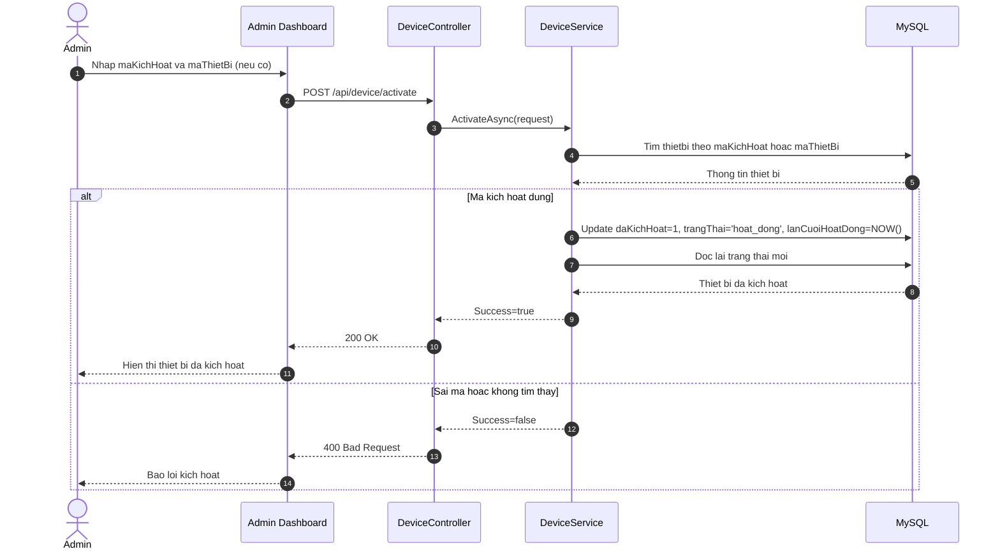
```mermaid
sequenceDiagram
    autonumber
    actor Admin
    participant Dashboard as Admin Dashboard
    participant DeviceCtl as DeviceController
    participant DeviceSvc as DeviceService
    participant DB as MySQL

    Admin->>Dashboard: Nhap maKichHoat va maThietBi (neu co)
    Dashboard->>DeviceCtl: POST /api/device/activate
    DeviceCtl->>DeviceSvc: ActivateAsync(request)
    DeviceSvc->>DB: Tim thietbi theo maKichHoat hoac maThietBi
    DB-->>DeviceSvc: Thong tin thiet bi

    alt Ma kich hoat dung
        DeviceSvc->>DB: Update daKichHoat=1, trangThai='hoat_dong', lanCuoiHoatDong=NOW()
        DeviceSvc->>DB: Doc lai trang thai moi
        DB-->>DeviceSvc: Thiet bi da kich hoat
        DeviceSvc-->>DeviceCtl: Success=true
        DeviceCtl-->>Dashboard: 200 OK
        Dashboard-->>Admin: Hien thi thiet bi da kich hoat
    else Sai ma hoac khong tim thay
        DeviceSvc-->>DeviceCtl: Success=false
        DeviceCtl-->>Dashboard: 400 Bad Request
        Dashboard-->>Admin: Bao loi kich hoat
    end
```

## 9. Xem trang thai thiet bi

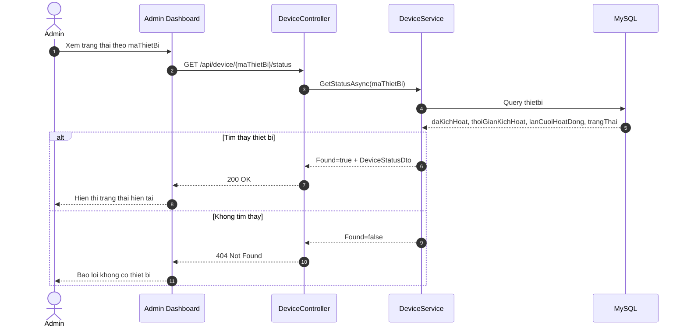
```mermaid
sequenceDiagram
    autonumber
    actor Admin
    participant Dashboard as Admin Dashboard
    participant DeviceCtl as DeviceController
    participant DeviceSvc as DeviceService
    participant DB as MySQL

    Admin->>Dashboard: Xem trang thai theo maThietBi
    Dashboard->>DeviceCtl: GET /api/device/{maThietBi}/status
    DeviceCtl->>DeviceSvc: GetStatusAsync(maThietBi)
    DeviceSvc->>DB: Query thietbi
    DB-->>DeviceSvc: daKichHoat, thoiGianKichHoat, lanCuoiHoatDong, trangThai

    alt Tim thay thiet bi
        DeviceSvc-->>DeviceCtl: Found=true + DeviceStatusDto
        DeviceCtl-->>Dashboard: 200 OK
        Dashboard-->>Admin: Hien thi trang thai hien tai
    else Khong tim thay
        DeviceSvc-->>DeviceCtl: Found=false
        DeviceCtl-->>Dashboard: 404 Not Found
        Dashboard-->>Admin: Bao loi khong co thiet bi
    end
```

## 10. Owner quan ly gian hang

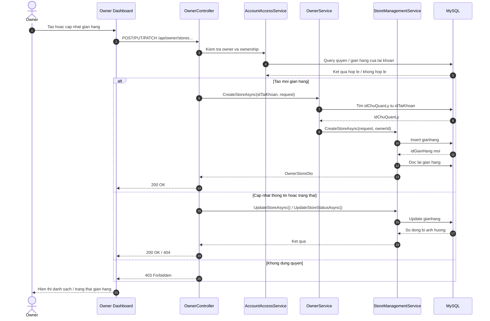
```mermaid
sequenceDiagram
    autonumber
    actor Owner
    participant Dashboard as Owner Dashboard
    participant OwnerCtl as OwnerController
    participant AccessSvc as AccountAccessService
    participant OwnerSvc as OwnerService
    participant StoreSvc as StoreManagementService
    participant DB as MySQL

    Owner->>Dashboard: Tao hoac cap nhat gian hang
    Dashboard->>OwnerCtl: POST/PUT/PATCH /api/owner/stores...
    OwnerCtl->>AccessSvc: Kiem tra owner va ownership
    AccessSvc->>DB: Query quyen / gian hang cua tai khoan
    DB-->>AccessSvc: Ket qua hop le / khong hop le

    alt Tao moi gian hang
        OwnerCtl->>OwnerSvc: CreateStoreAsync(idTaiKhoan, request)
        OwnerSvc->>DB: Tim idChuQuanLy tu idTaiKhoan
        DB-->>OwnerSvc: idChuQuanLy
        OwnerSvc->>StoreSvc: CreateStoreAsync(request, ownerId)
        StoreSvc->>DB: Insert gianhang
        DB-->>StoreSvc: idGianHang moi
        StoreSvc->>DB: Doc lai gian hang
        StoreSvc-->>OwnerCtl: OwnerStoreDto
        OwnerCtl-->>Dashboard: 200 OK
    else Cap nhat thong tin hoac trang thai
        OwnerCtl->>StoreSvc: UpdateStoreAsync() / UpdateStoreStatusAsync()
        StoreSvc->>DB: Update gianhang
        DB-->>StoreSvc: So dong bi anh huong
        StoreSvc-->>OwnerCtl: Ket qua
        OwnerCtl-->>Dashboard: 200 OK / 404
    else Khong dung quyen
        OwnerCtl-->>Dashboard: 403 Forbidden
    end

    Dashboard-->>Owner: Hien thi danh sach / trang thai gian hang
```

## 11. Quan ly mon an

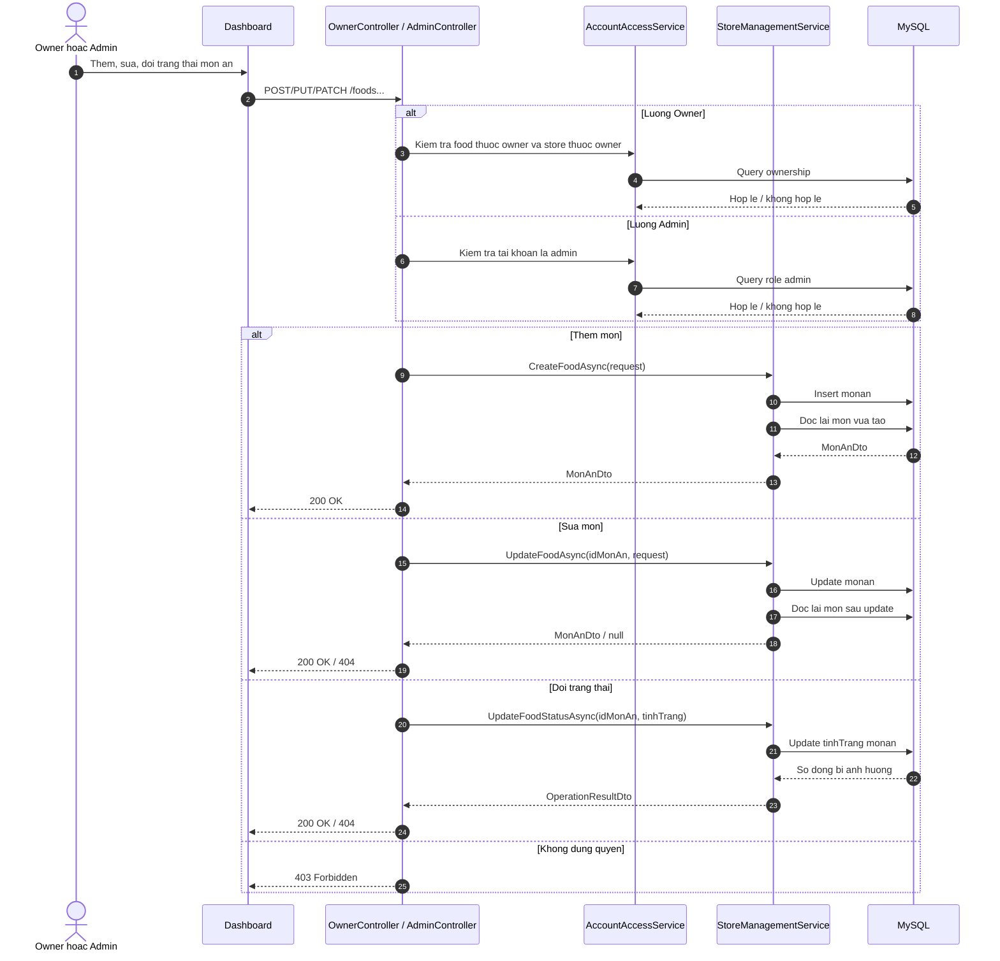
```mermaid
sequenceDiagram
    autonumber
    actor Staff as Owner hoac Admin
    participant UI as Dashboard
    participant Ctl as OwnerController / AdminController
    participant AccessSvc as AccountAccessService
    participant StoreSvc as StoreManagementService
    participant DB as MySQL

    Staff->>UI: Them, sua, doi trang thai mon an
    UI->>Ctl: POST/PUT/PATCH /foods...

    alt Luong Owner
        Ctl->>AccessSvc: Kiem tra food thuoc owner va store thuoc owner
        AccessSvc->>DB: Query ownership
        DB-->>AccessSvc: Hop le / khong hop le
    else Luong Admin
        Ctl->>AccessSvc: Kiem tra tai khoan la admin
        AccessSvc->>DB: Query role admin
        DB-->>AccessSvc: Hop le / khong hop le
    end

    alt Them mon
        Ctl->>StoreSvc: CreateFoodAsync(request)
        StoreSvc->>DB: Insert monan
        StoreSvc->>DB: Doc lai mon vua tao
        DB-->>StoreSvc: MonAnDto
        StoreSvc-->>Ctl: MonAnDto
        Ctl-->>UI: 200 OK
    else Sua mon
        Ctl->>StoreSvc: UpdateFoodAsync(idMonAn, request)
        StoreSvc->>DB: Update monan
        StoreSvc->>DB: Doc lai mon sau update
        StoreSvc-->>Ctl: MonAnDto / null
        Ctl-->>UI: 200 OK / 404
    else Doi trang thai
        Ctl->>StoreSvc: UpdateFoodStatusAsync(idMonAn, tinhTrang)
        StoreSvc->>DB: Update tinhTrang monan
        DB-->>StoreSvc: So dong bi anh huong
        StoreSvc-->>Ctl: OperationResultDto
        Ctl-->>UI: 200 OK / 404
    else Khong dung quyen
        Ctl-->>UI: 403 Forbidden
    end
```

## 12. Generate audio TTS tu mo ta gian hang

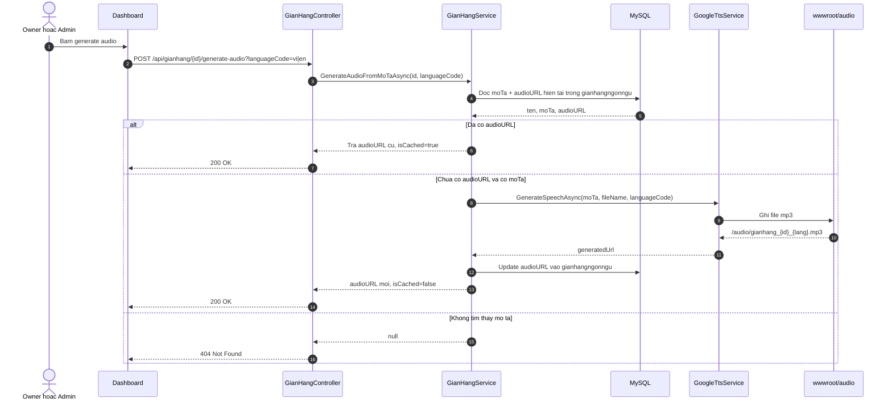
```mermaid
sequenceDiagram
    autonumber
    actor Staff as Owner hoac Admin
    participant UI as Dashboard
    participant GianHangCtl as GianHangController
    participant GianHangSvc as GianHangService
    participant DB as MySQL
    participant TTS as GoogleTtsService
    participant FileStore as wwwroot/audio

    Staff->>UI: Bam generate audio
    UI->>GianHangCtl: POST /api/gianhang/{id}/generate-audio?languageCode=vi|en
    GianHangCtl->>GianHangSvc: GenerateAudioFromMoTaAsync(id, languageCode)
    GianHangSvc->>DB: Doc moTa + audioURL hien tai trong gianhangngonngu
    DB-->>GianHangSvc: ten, moTa, audioURL

    alt Da co audioURL
        GianHangSvc-->>GianHangCtl: Tra audioURL cu, isCached=true
        GianHangCtl-->>UI: 200 OK
    else Chua co audioURL va co moTa
        GianHangSvc->>TTS: GenerateSpeechAsync(moTa, fileName, languageCode)
        TTS->>FileStore: Ghi file mp3
        FileStore-->>TTS: /audio/gianhang_{id}_{lang}.mp3
        TTS-->>GianHangSvc: generatedUrl
        GianHangSvc->>DB: Update audioURL vao gianhangngonngu
        GianHangSvc-->>GianHangCtl: audioURL moi, isCached=false
        GianHangCtl-->>UI: 200 OK
    else Khong tim thay mo ta
        GianHangSvc-->>GianHangCtl: null
        GianHangCtl-->>UI: 404 Not Found
    end
```

## 13. Cập nhật mô tả và tạo lại audio

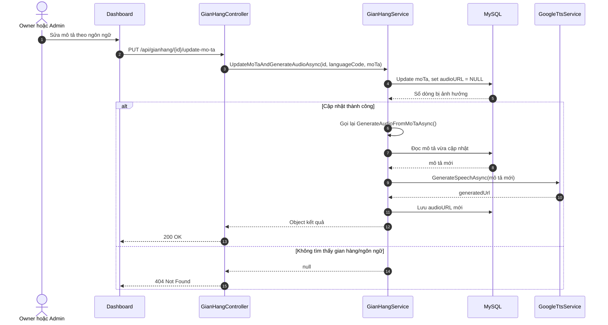
```mermaid
sequenceDiagram
    autonumber
    actor Staff as Owner hoặc Admin
    participant UI as Dashboard
    participant GianHangCtl as GianHangController
    participant GianHangSvc as GianHangService
    participant DB as MySQL
    participant TTS as GoogleTtsService

    Staff->>UI: Sửa mô tả theo ngôn ngữ
    UI->>GianHangCtl: PUT /api/gianhang/{id}/update-mo-ta
    GianHangCtl->>GianHangSvc: UpdateMoTaAndGenerateAudioAsync(id, languageCode, moTa)
    GianHangSvc->>DB: Update moTa, set audioURL = NULL
    DB-->>GianHangSvc: Số dòng bị ảnh hưởng

    alt Cập nhật thành công
        GianHangSvc->>GianHangSvc: Gọi lại GenerateAudioFromMoTaAsync()
        GianHangSvc->>DB: Đọc mô tả vừa cập nhật
        DB-->>GianHangSvc: mô tả mới
        GianHangSvc->>TTS: GenerateSpeechAsync(mô tả mới)
        TTS-->>GianHangSvc: generatedUrl
        GianHangSvc->>DB: Lưu audioURL mới
        GianHangSvc-->>GianHangCtl: Object kết quả
        GianHangCtl-->>UI: 200 OK
    else Không tìm thấy gian hàng/ngôn ngữ
        GianHangSvc-->>GianHangCtl: null
        GianHangCtl-->>UI: 404 Not Found
    end
```

## 14. Admin xem tổng quan hệ thống

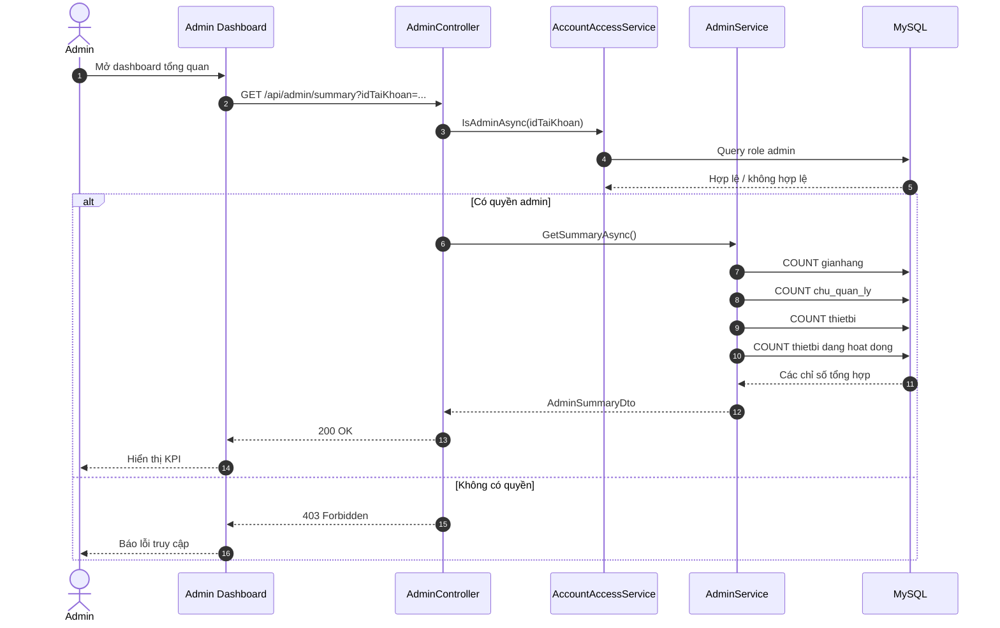
```mermaid
sequenceDiagram
    autonumber
    actor Admin
    participant Dashboard as Admin Dashboard
    participant AdminCtl as AdminController
    participant AccessSvc as AccountAccessService
    participant AdminSvc as AdminService
    participant DB as MySQL

    Admin->>Dashboard: Mở dashboard tổng quan
    Dashboard->>AdminCtl: GET /api/admin/summary?idTaiKhoan=...
    AdminCtl->>AccessSvc: IsAdminAsync(idTaiKhoan)
    AccessSvc->>DB: Query role admin
    DB-->>AccessSvc: Hợp lệ / không hợp lệ

    alt Có quyền admin
        AdminCtl->>AdminSvc: GetSummaryAsync()
        AdminSvc->>DB: COUNT gianhang
        AdminSvc->>DB: COUNT chu_quan_ly
        AdminSvc->>DB: COUNT thietbi
        AdminSvc->>DB: COUNT thietbi dang hoat dong
        DB-->>AdminSvc: Các chỉ số tổng hợp
        AdminSvc-->>AdminCtl: AdminSummaryDto
        AdminCtl-->>Dashboard: 200 OK
        Dashboard-->>Admin: Hiển thị KPI
    else Không có quyền
        AdminCtl-->>Dashboard: 403 Forbidden
        Dashboard-->>Admin: Báo lỗi truy cập
    end
```

## 15. Admin xem danh sách và cập nhật gian hàng

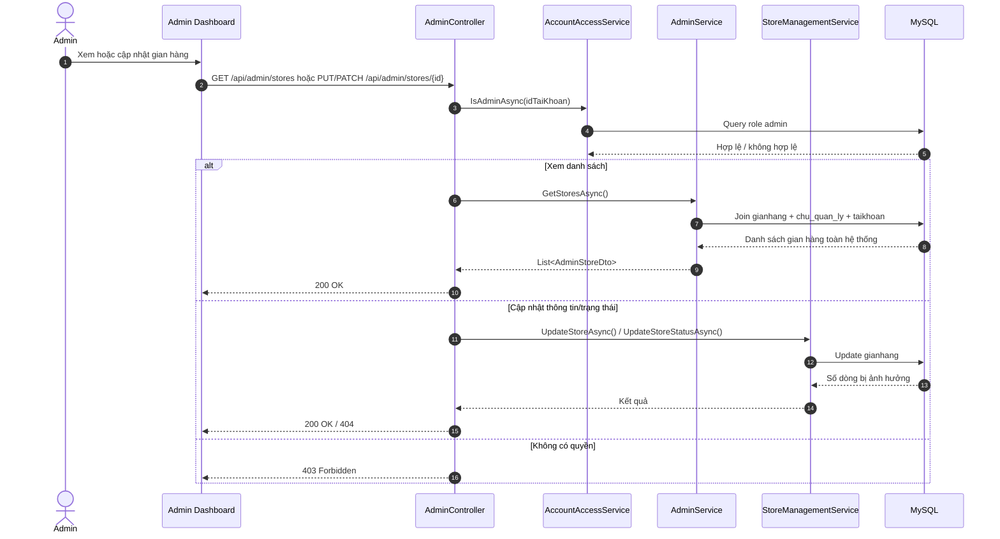
```mermaid
sequenceDiagram
    autonumber
    actor Admin
    participant Dashboard as Admin Dashboard
    participant AdminCtl as AdminController
    participant AccessSvc as AccountAccessService
    participant AdminSvc as AdminService
    participant StoreSvc as StoreManagementService
    participant DB as MySQL

    Admin->>Dashboard: Xem hoặc cập nhật gian hàng
    Dashboard->>AdminCtl: GET /api/admin/stores hoặc PUT/PATCH /api/admin/stores/{id}
    AdminCtl->>AccessSvc: IsAdminAsync(idTaiKhoan)
    AccessSvc->>DB: Query role admin
    DB-->>AccessSvc: Hợp lệ / không hợp lệ

    alt Xem danh sách
        AdminCtl->>AdminSvc: GetStoresAsync()
        AdminSvc->>DB: Join gianhang + chu_quan_ly + taikhoan
        DB-->>AdminSvc: Danh sách gian hàng toàn hệ thống
        AdminSvc-->>AdminCtl: List<AdminStoreDto>
        AdminCtl-->>Dashboard: 200 OK
    else Cập nhật thông tin/trạng thái
        AdminCtl->>StoreSvc: UpdateStoreAsync() / UpdateStoreStatusAsync()
        StoreSvc->>DB: Update gianhang
        DB-->>StoreSvc: Số dòng bị ảnh hưởng
        StoreSvc-->>AdminCtl: Kết quả
        AdminCtl-->>Dashboard: 200 OK / 404
    else Không có quyền
        AdminCtl-->>Dashboard: 403 Forbidden
    end
```

## 19. Activity thanh toán online và giá trị trả về

```mermaid
flowchart TD
    Start((Bắt đầu)) --> SelectPackage["Người dùng chọn gói và xác nhận thanh toán"]
    SelectPackage --> CheckNetwork{"Thiết bị có Internet?"}

    CheckNetwork -- Không --> NoNetwork["Trả FAILED\ncode: NO_NETWORK\nmessage: Cần kết nối mạng"]
    NoNetwork --> EndNoNetwork((Kết thúc))

    CheckNetwork -- Có --> SendRequest["App gửi request đăng ký gói\npackageId, clientDeviceId, email?"]
    SendRequest --> CreatePending["Backend tạo paymentRequest\nvà hóa đơn PENDING"]
    CreatePending --> InitOk{"Tạo paymentUrl / qrPayload thành công?"}

    InitOk -- Không --> InitFailed["Trả PAYMENT_INIT_FAILED\nerrorCode, message"]
    InitFailed --> EndInitFail((Kết thúc))

    InitOk -- Có --> ReturnPending["Trả PENDING\npaymentRequestId, invoiceId,\npaymentUrl/qrPayload, amount, expiresAt"]
    ReturnPending --> ShowPayment["App hiện QR / paymentUrl\nvà chờ người dùng thanh toán"]
    ShowPayment --> ReceiveStatus{"Nhận webhook / callback\nhoặc người dùng kiểm tra lại?"}

    ReceiveStatus -- Chưa --> StillPending["Trả PENDING hoặc VERIFYING\npaymentRequestId, invoiceId, reason"]
    StillPending --> EndPending((Kết thúc))

    ReceiveStatus -- Rồi --> CallbackValid{"Callback hợp lệ\nvà có chữ ký đúng?"}

    CallbackValid -- Không --> ManualReview["Ghi log và đưa vào\nkiểm tra thủ công"]
    ManualReview --> ReturnManual["Trả VERIFYING\npaymentRequestId, invoiceId, reason"]
    ReturnManual --> EndManual((Kết thúc))

    CallbackValid -- Có --> PaymentSuccess{"Thanh toán thành công?"}

    PaymentSuccess -- Không --> UpdateFailed["Cập nhật hóa đơn\nFAILED hoặc CANCELLED"]
    UpdateFailed --> ReturnFailed["Trả FAILED hoặc CANCELLED\npaymentRequestId, invoiceId, reason"]
    ReturnFailed --> EndFailed((Kết thúc))

    PaymentSuccess -- Có --> Reconcile["Đối soát amount, orderId,\ntransactionId, signature"]
    Reconcile --> Match{"Dữ liệu đối soát khớp?"}

    Match -- Không --> NeedVerify["Đánh dấu VERIFYING\nchờ đối soát lại"]
    NeedVerify --> ReturnVerify["Trả VERIFYING\npaymentRequestId, invoiceId, reason"]
    ReturnVerify --> EndVerify((Kết thúc))

    Match -- Có --> CreateAccess["Tạo quyền truy cập,\nkhóa vào thiết bị hiện tại"]
    CreateAccess --> CreateQr["Tạo QR token đăng nhập\nvà chuẩn bị payload trả về"]
    CreateQr --> Success["Trả SUCCESS\ninvoiceId, packageId,\naccessToken, accessExpiresAt,\nqrPayload, emailStatus?"]
    Success --> SaveAccess["App lưu quyền truy cập\nvà mở nội dung chính"]
    SaveAccess --> EndSuccess((Kết thúc))
```
