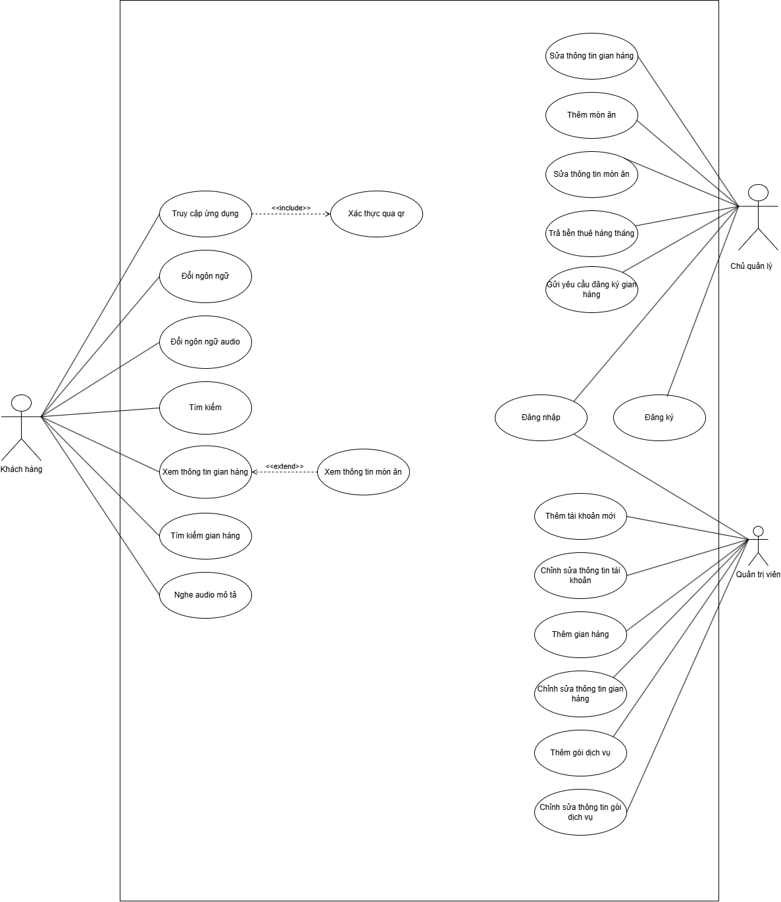
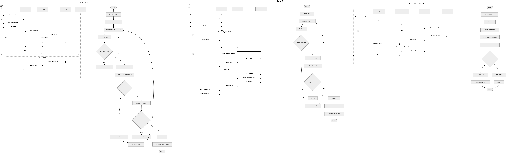

# PRD - Vinh Khanh Smart Tourism

**Phien ban:** 2.0  
**Ngay cap nhat:** 17/04/2026  
**Trang thai:** Draft theo source code hien tai  
**Pham vi:** MAUI mobile app, ASP.NET Core backend API, dashboard web quan tri/chu quan ly, MySQL database.

---

## 1. Can cu tai lieu

Tai lieu nay duoc viet lai dua tren:

- Source mobile app trong `C-SA-T`: man hinh access, goi dich vu, quet QR, ban do POI, chi tiet gian hang, audio, da ngon ngu, cache offline.
- Source backend trong `VinhKhanh/VinhKhanh`: controller, service, DTO, MySQL schema va endpoint API.
- Dashboard web trong `CS_admin`: dang nhap/dang ky, quan ly gian hang, mon an, tai khoan, goi dich vu, yeu cau gian hang.
- Database MySQL `gianhang` hien tai: class diagram da doc truc tiep tu `information_schema`.
- Bo hinh co san trong `../prd-assets/mermaid`: `usecase.drawio.png`, `Class Diagram.drawio.png`, `GianHang-Page-4.drawio.png`, `GianHang-Page-3.jpg`.
- Lich su commit gan day:

| Commit | Noi dung chinh duoc phan anh vao PRD |
|---|---|
| `2677a5f` | Fix app bugs, image/audio/lang, access pages |
| `cfaa5d1` | Fix logic QR token, activity/sequence access |
| `791cbad` | Goi dich vu, QR mua goi, bypass thanh toan |
| `8577f4e` | Admin/backend features, request gian hang, service packages |
| `c9908b4` | Dang ky web cho chu quan ly |
| `b1987ae` | Cap nhat ngon ngu app, audio, geofence |
| `fdd005f` | Fix SQLite/offline cache |
| `2dca51f` | Fix map |

---

## 2. Tong quan san pham

Vinh Khanh Smart Tourism la he thong du lich thong minh cho khu vuc Vinh Khanh, giup du khach mo app, mua goi truy cap, xem ban do/danh sach gian hang, tim kiem dia diem, xem mon an, nghe audio mo ta theo ngon ngu, va tu dong phat audio khi den gan gian hang.

He thong gom 3 phan:

| Thanh phan | Vai tro |
|---|---|
| MAUI Mobile App | App cho du khach: token access, goi dich vu, QR token, map, danh sach, chi tiet, audio, ngon ngu, offline cache |
| ASP.NET Core Backend | API xu ly auth, access token, goi dich vu, gian hang, mon an, admin/owner, Google TTS, MySQL |
| CS_admin Web Dashboard | Giao dien web cho admin va chu quan ly quan ly du lieu he thong |

---

## 3. Muc tieu san pham

| Muc tieu | Ket qua mong muon |
|---|---|
| Du khach vao app co kiem soat | Moi phien su dung duoc bao ve bang token theo goi da mua |
| Mot token chi dung tren mot may | Token duoc khoa vao `clientDeviceId`; may khac quet lai se bi tu choi |
| Noi dung gian hang de kham pha | Co ban do, danh sach, tim kiem, chi tiet gian hang, chi tiet mon an |
| Ho tro trai nghiem da ngon ngu | Doi ngon ngu app va audio/mo ta theo bang `ngonngu` |
| Ho tro audio guide | Audio mo ta co the phat thu cong hoac tu dong khi vao vung geofence |
| Dashboard quan tri du lieu | Admin/chu quan ly co the quan ly tai khoan, gian hang, mon an, goi dich vu, yeu cau gian hang |
| Hoat dong khi mang yeu | App co cache SQLite, fallback du lieu cu khi API khong san sang |

---

## 4. Nguoi dung va vai tro

| Vai tro | Mo ta | Kenh su dung |
|---|---|---|
| Nguoi dung app / du khach | Mua goi, vao app, xem/noi dung du lich, nghe audio | MAUI app |
| Chu quan ly | Dang ky tai khoan, gui yeu cau gian hang, quan ly gian hang/mon an cua minh | CS_admin dashboard |
| Admin | Quan ly toan he thong, tai khoan, gian hang, mon an, goi dich vu, duyet yeu cau | CS_admin dashboard + backend API |
| Dich vu ngoai | SMTP email, Google Text-to-Speech | Backend service |

---

## 5. Pham vi MVP hien tai

### 5.1 Trong pham vi

- Kiem tra token khi mo app.
- Dang ky goi dich vu trong app.
- Hien QR thanh toan mo phong.
- Bypass thanh toan de tao token theo goi.
- Tao mot QR token dang nhap duy nhat va gui qua email neu SMTP da cau hinh.
- Khoa token vao may hien tai khi tao goi.
- Quet lai QR token tu email de vao lai tren cung may.
- Tu choi token neu quet tren may khac.
- Luu token access trong `Preferences`.
- Ban do/danh sach/tim kiem gian hang.
- Xem chi tiet gian hang va mon an.
- Doi ngon ngu app/audio.
- Phat audio mo ta va tu dong phat khi vao geofence.
- Cache app data va audio cho trai nghiem offline.
- Admin/owner dang nhap, dang ky, quan ly du lieu.
- Google TTS tao audio tu mo ta gian hang.

### 5.2 Ngoai pham vi hien tai

- Webhook thanh toan that tu ngan hang/vi dien tu.
- QR khoi phuc rieng. He thong chi dung mot QR token dang nhap.
- Token dung chung nhieu thiet bi.
- Analytics nang cao nhu heatmap, top POI, bao cao doanh thu chi tiet.
- App Store/Play Store production release.

---

## 6. Use case tong quat

Use case app hien tap trung vao cac chuc nang nguoi dung mobile:

- Mo app va kiem tra token.
- Dang ky goi dich vu.
- Quet QR token dang nhap.
- Xem ban do/danh sach/tim kiem gian hang.
- Xem thong tin gian hang va mon an.
- Doi ngon ngu app/audio.
- Nghe audio mo ta va tu dong phat khi den gan.
- Xem du lieu offline.
- Cai dat va reset token truy cap.

---

## 7. Yeu cau chuc nang

### F01 - Mo app va kiem tra token

**Nguoi dung:** Du khach  
**Trang thai:** Da co trong app

Khi mo app, `AccessEntryPage` goi `AccessFlowService.ValidateCurrentAccessAsync()`.

| Dieu kien | Xu ly |
|---|---|
| Khong co token local | Hien man hinh chon Quet QR / Dang ky goi |
| Co token local | Goi `GET /api/access/validate` kem `accessToken` va `clientDeviceId` |
| Token hop le va dung may | Mo HomePage/noi dung chinh |
| Token het han/sai may/khong ton tai | Xoa token local, yeu cau truy cap lai |

### F02 - Dang ky goi dich vu trong app

**Nguoi dung:** Du khach  
**Trang thai:** Da co luong mo phong thanh toan

Nguoi dung chon goi, nhap email, app hien QR thanh toan. Hien tai luong thanh toan that chua implement webhook, nen app co bypass de test/activate.

| Buoc | Mo ta |
|---|---|
| Chon goi | Goi 1/7/30 ngay hoac goi lay tu backend |
| Nhap email | Email dung de nhan QR token dang nhap |
| Hien QR thanh toan | Payload dang `PAYQR|goi=...|email=...|gia=...` |
| Bypass thanh toan | Goi `POST /api/access/package/register` voi `bypassPayment=true` |
| Backend tao token | Tao `phien_vao_app`, `hoadon`, thoi han theo goi |
| Khoa token vao may | Gan token voi `clientDeviceId` hien tai |
| Gui email | Gui dung mot QR token dang nhap qua SMTP neu da cau hinh |
| Vao app | App luu token va hien nut Vao app |

### F03 - Quet QR token dang nhap

**Nguoi dung:** Du khach  
**Trang thai:** Da co

QR token la QR duy nhat gui qua email sau khi mua goi. Day khong phai QR khoi phuc rieng.

| Dieu kien | Ket qua |
|---|---|
| Token con han va dung may da kich hoat | Luu token vao may, cho vao app |
| Token het han/khong ton tai | Bao loi QR khong hop le |
| Token dung nhung may khac quet | Bao loi token chi dung tren mot may |
| May reset/doi `clientDeviceId` | Bi xem nhu may khac, khong duoc nhan token cu |

### F04 - Ban do va danh sach gian hang

**Nguoi dung:** Du khach  
**Trang thai:** Da co

- Lay data qua `GET /api/gianhang/appdata?lang=...`.
- Hien gian hang tren map neu co `lat/lon`.
- Hien danh sach va cho xem chi tiet.
- Dung Google Maps key tu `Secrets.props` hoac `Secret/props.txt`.

### F05 - Tim kiem gian hang/mon an

**Nguoi dung:** Du khach  
**Trang thai:** Da co so do sequence/search

- Tim theo ten gian hang, dia chi, mon an.
- Mo chi tiet gian hang tu ket qua tim.
- Chi tiet gian hang gom hinh anh, mo ta, audio, mon an.

### F06 - Chi tiet mon an

**Nguoi dung:** Du khach  
**Trang thai:** Da co

- Xem mon an theo gian hang.
- Hien ten, gia, mo ta, hinh anh, trang thai.
- Ho tro mo ta mon an theo ngon ngu qua bang `monanngonngu`.

### F07 - Da ngon ngu

**Nguoi dung:** Du khach  
**Trang thai:** Da co

- `LocalizationService` xu ly ngon ngu app.
- Data gian hang/mon an lay theo `lang`.
- Audio mo ta lay theo ngon ngu tu `gianhangngonngu.audioURL`.
- Cac ngon ngu duoc mo rong qua bang `ngonngu`.

### F08 - Audio guide va geofence

**Nguoi dung:** Du khach  
**Trang thai:** Da co

- Geofence radius mac dinh: 10m.
- Poll interval: 3 giay.
- Khi vao gan gian hang, he thong schedule auto-play sau 3 giay.
- Co audio playback banner, play/pause/stop/seek.
- `AudioCacheService` tai/cache audio de giam phu thuoc mang.

### F09 - Offline cache

**Nguoi dung:** Du khach  
**Trang thai:** Da co

- `AppDataCacheService` dung memory cache va SQLite.
- Cache app data TTL 12 gio.
- Khi API fail, app co the fallback cache moi hoac cache cu.
- Co cleanup cache cu sau grace period.

### F10 - Dang nhap/dang ky web

**Nguoi dung:** Admin, chu quan ly  
**Trang thai:** Da co

- Web `CS_admin/auth.php` goi proxy `api/auth-login-proxy.php` va `api/auth-register-proxy.php`.
- Backend co `POST /api/auth/login` va `POST /api/auth/register`.
- Tai khoan co role `admin`, `chu_quan_ly`, `khach_hang`.

### F11 - Chu quan ly quan ly gian hang

**Nguoi dung:** Chu quan ly  
**Trang thai:** Da co

- Xem danh sach gian hang cua minh.
- Gui yeu cau dang ky gian hang.
- Cap nhat thong tin gian hang.
- Upload anh gian hang.
- Quan ly mon an: them/sua/trang thai/upload anh.
- Quyen duoc check qua `AccountAccessService`.

### F12 - Admin quan ly he thong

**Nguoi dung:** Admin  
**Trang thai:** Da co

- Xem summary.
- Quan ly tai khoan.
- Tao/khoa/mo tai khoan.
- Quan ly gian hang va mon an toan he thong.
- Duyet/tu choi yeu cau gian hang.
- Quan ly goi dich vu: them, sua, doi trang thai.

### F13 - Google Text-to-Speech

**Nguoi dung:** Admin/chu quan ly gian hang  
**Trang thai:** Da co backend

- Endpoint `POST /api/gianhang/{id}/generate-audio`.
- Endpoint `PUT /api/gianhang/{id}/update-mo-ta`.
- Service `GoogleTtsService` tao file audio trong `wwwroot/audio`.
- URL audio duoc luu vao DB.

---

## 8. Luong truy cap QR token

Quy tac san pham:

1. He thong chi co mot loai QR cho access: QR token dang nhap.
2. QR token duoc gui qua email sau khi dang ky goi thanh cong.
3. Token duoc tao theo thoi han goi va khoa vao may hien tai.
4. Neu mat token local do xoa app/loi local, nguoi dung quet lai QR token trong email tren cung may de vao lai.
5. Neu may bi reset lam doi `clientDeviceId`, he thong xem la may moi va tu choi token cu.
6. Khong co QR khoi phuc rieng.

---

## 9. Du lieu va class diagram DB

Class diagram trong PRD dang dung file `Class Diagram.drawio.png` co san trong folder. Noi dung DB van duoc doi chieu voi MySQL `information_schema` khi viet PRD.

Bang chinh:

| Nhom | Bang |
|---|---|
| Tai khoan | `taikhoan`, `admin`, `chu_quan_ly`, `khachhang` |
| Gian hang | `gianhang`, `gianhangngonngu`, `hinhanhgianhang`, `yeucaugianhang` |
| Mon an | `monan`, `monanngonngu`, `hinhanhmonan` |
| Ngon ngu | `ngonngu` |
| Goi/access | `goidichvu`, `thietbi`, `phien_vao_app`, `hoadon` |
| Hoa don chi tiet | `chitiethoadon`, `hoadongianhang` |

Ghi chu: DB hien tai co `yeucaugianhang_backup_20260416`, day la bang backup migration, khong phai bang nghiep vu chinh.

---

## 10. Bo so do thiet ke trong folder

Hinh tren la file tong hop thiet ke co san trong folder, gom nhieu activity/sequence phuc vu doi chieu PRD.

---

## 11. API backend

### Access

| Method | Endpoint | Muc dich |
|---|---|---|
| `POST` | `/api/access/scan` | Legacy/scan QR thiet bi, tao access session theo ma thiet bi/goi |
| `GET` | `/api/access/validate` | Kiem tra token, han dung, dung thiet bi |
| `POST` | `/api/access/token/activate` | Kich hoat/quet lai QR token dang nhap tren dung may |
| `POST` | `/api/access/package/register` | Dang ky goi, tao token, tao hoa don, gui email QR token |

### Auth

| Method | Endpoint | Muc dich |
|---|---|---|
| `POST` | `/api/auth/login` | Dang nhap admin/chu quan ly/app |
| `POST` | `/api/auth/register` | Dang ky chu quan ly |

### App data / POI

| Method | Endpoint | Muc dich |
|---|---|---|
| `GET` | `/api/gianhang/appdata` | Lay du lieu app theo ngon ngu |
| `GET` | `/api/gianhang` | Danh sach gian hang |
| `GET` | `/api/gianhang/{id}` | Chi tiet gian hang |
| `GET` | `/api/gianhang/nearby` | Gian hang gan vi tri |
| `GET` | `/api/poi` | Danh sach POI |
| `GET` | `/api/monan/by-gianhang/{idGianHang}` | Danh sach mon an cua gian hang |

### Audio/TTS

| Method | Endpoint | Muc dich |
|---|---|---|
| `POST` | `/api/gianhang/{id}/generate-audio` | Tao audio mo ta |
| `PUT` | `/api/gianhang/{id}/update-mo-ta` | Cap nhat mo ta va tao lai audio |

### Device

| Method | Endpoint | Muc dich |
|---|---|---|
| `POST` | `/api/device/activate` | Kich hoat thiet bi |
| `GET` | `/api/device/{maThietBi}/status` | Xem trang thai thiet bi |

### Owner

| Method | Endpoint | Muc dich |
|---|---|---|
| `GET` | `/api/owner/stores` | Danh sach gian hang cua owner |
| `GET` | `/api/owner/stores/{idGianHang}` | Chi tiet gian hang owner |
| `POST` | `/api/owner/stores` | Tao gian hang |
| `GET` | `/api/owner/store-requests` | Xem yeu cau gian hang |
| `POST` | `/api/owner/store-requests` | Gui yeu cau gian hang |
| `PUT` | `/api/owner/stores/{idGianHang}` | Sua gian hang |
| `PATCH` | `/api/owner/stores/{idGianHang}/status` | Doi trang thai gian hang |
| `POST` | `/api/owner/stores/{idGianHang}/image` | Upload anh gian hang |
| `GET` | `/api/owner/stores/{idGianHang}/foods` | Mon an cua gian hang |
| `POST` | `/api/owner/foods` | Tao mon an |
| `PUT` | `/api/owner/foods/{idMonAn}` | Sua mon an |
| `PATCH` | `/api/owner/foods/{idMonAn}/status` | Doi trang thai mon an |
| `POST` | `/api/owner/foods/{idMonAn}/image` | Upload anh mon an |

### Admin

| Method | Endpoint | Muc dich |
|---|---|---|
| `GET` | `/api/admin/summary` | Tong quan he thong |
| `GET` | `/api/admin/stores` | Danh sach gian hang |
| `GET` | `/api/admin/stores/{idGianHang}` | Chi tiet gian hang |
| `GET` | `/api/admin/owners` | Danh sach chu quan ly |
| `GET` | `/api/admin/accounts` | Danh sach tai khoan |
| `POST` | `/api/admin/accounts` | Tao tai khoan |
| `PATCH` | `/api/admin/accounts/{targetAccountId}/status` | Khoa/mo tai khoan |
| `GET` | `/api/admin/store-requests` | Danh sach yeu cau gian hang |
| `PATCH` | `/api/admin/store-requests/{idYeuCau}/review` | Duyet/tu choi yeu cau |
| `GET` | `/api/admin/service-packages` | Danh sach goi dich vu |
| `POST` | `/api/admin/service-packages` | Tao goi dich vu |
| `PUT` | `/api/admin/service-packages/{idGoi}` | Sua goi dich vu |
| `PATCH` | `/api/admin/service-packages/{idGoi}/status` | Doi trang thai goi |
| `POST/PUT/PATCH` | `/api/admin/stores/*`, `/api/admin/foods/*` | Quan ly gian hang/mon an toan he thong |

---

## 12. Yeu cau phi chuc nang

| Nhom | Yeu cau |
|---|---|
| Bao mat access | Token phai kiem tra han dung va dung `clientDeviceId` |
| Bao mat role | Owner/Admin endpoint phai kiem tra `idTaiKhoan` va role |
| Offline | App phai doc duoc cache SQLite khi API loi |
| Hieu nang | App data nen duoc cache memory + SQLite, tranh goi API lap lai |
| Da ngon ngu | Mo rong ngon ngu qua DB, khong hard-code toan bo noi dung data |
| Audio | Audio phai cache/tai lai duoc, khong lam app crash khi mat mang |
| Cau hinh secret | SMTP, Google Maps, Google service account khong dua len PRD/commit |
| Kha nang test | Luong thanh toan bypass duoc ghi ro la test, khong nham voi payment production |

---

## 13. Tieu chi chap nhan MVP

| Hang muc | Tieu chi chap nhan |
|---|---|
| Access token | Mo app co token hop le thi vao duoc, token sai may bi tu choi |
| Dang ky goi | Sau bypass thanh toan, app co token, QR token, han dung, nut Vao app |
| Email QR | Neu SMTP san sang, nguoi dung nhan dung mot QR token dang nhap |
| Quet lai QR | QR email vao lai duoc tren dung may, khong vao duoc tren may khac |
| Map/list/search | Hien duoc gian hang, tim va mo chi tiet |
| Audio/geofence | Vao gan gian hang co audio phu hop ngon ngu va co the phat |
| Offline | Tat API/mat mang van hien duoc du lieu cache gan nhat neu da sync |
| Dashboard | Admin/owner quan ly duoc tai khoan, goi, gian hang, mon an, yeu cau |

---

## 14. Han che hien tai va viec can lam tiep

| Muc | Trang thai | Huong xu ly |
|---|---|---|
| Thanh toan that | Chua implement webhook, dang bypass | Tich hop payment provider, xac thuc giao dich, tat bypass o production |
| Email | Phu thuoc SMTP config | Them man hinh/healthcheck cau hinh email |
| Backup table trong DB | `yeucaugianhang_backup_20260416` con ton tai | Xac nhan co giu de audit hay drop khoi production |
| Bao mat API | Dang truyen `idTaiKhoan` qua query o nhieu endpoint | Chuyen sang JWT/session chuan neu deploy that |
| Ten app | `ApplicationTitle` con la `MauiApp1` | Doi thanh Vinh Khanh Smart Tourism truoc release |
| Secret local | Co file config local dang modified | Khong commit secret, dung example/env/user-secrets |

---

## 15. Roadmap de xuat

| Giai doan | Noi dung |
|---|---|
| v2.0 - Hoan thien MVP | Chot access token one-device, PRD/diagram, fix encoding tai lieu, on dinh dashboard |
| v2.1 - Payment production | Webhook thanh toan that, ma giao dich, doi soat hoa don |
| v2.2 - Security hardening | JWT/session, role claims, rate limit QR/token |
| v2.3 - Analytics | Luot vao app, luot xem gian hang, audio played, goi ban chay |
| v2.4 - UX polish | Ten app, icon, onboarding, empty states, offline indicators |

---

## 16. Trang HTML PRD

Ban HTML cua PRD nam tai:

`prd.html`

Mo file nay truc tiep bang trinh duyet de xem ban trinh bay co layout, card va hinh so do.
