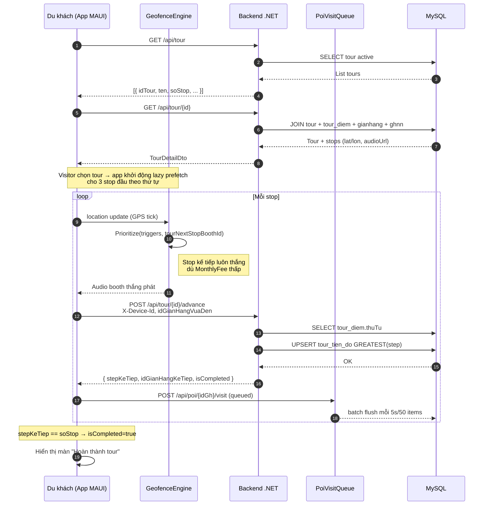
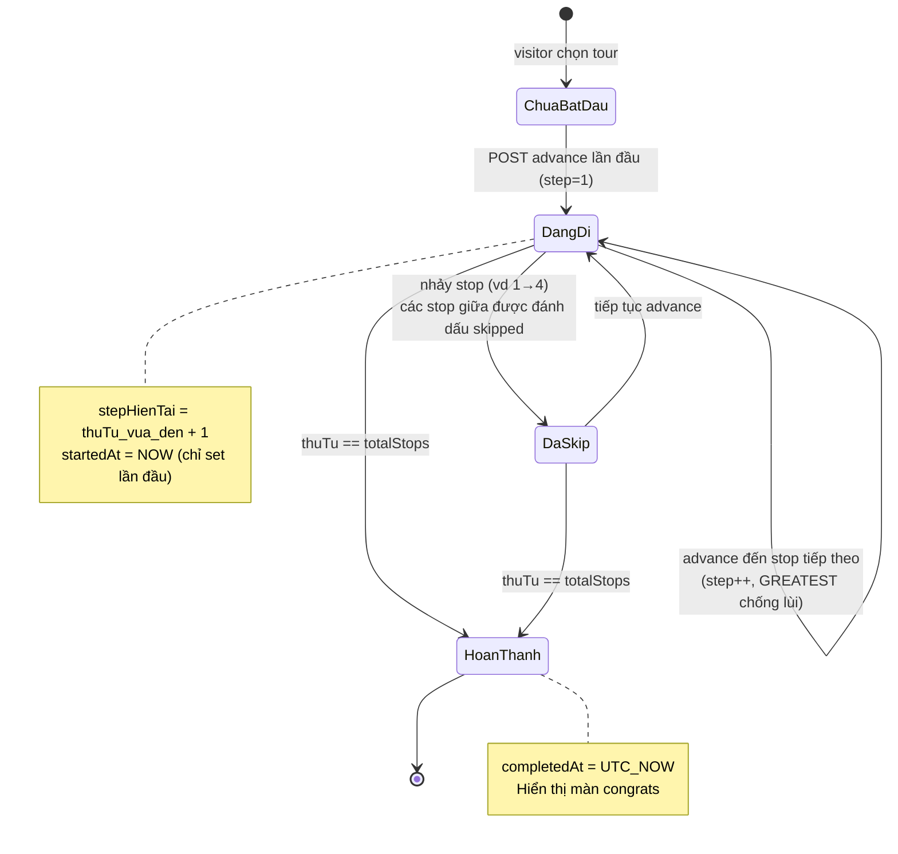
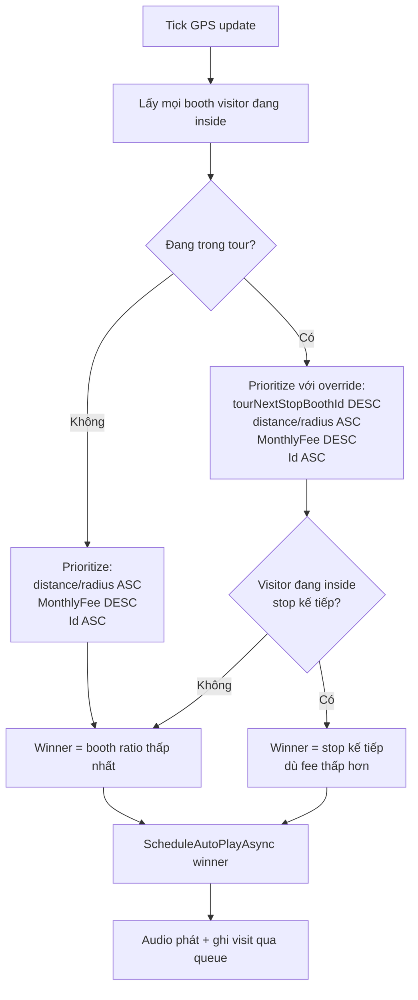
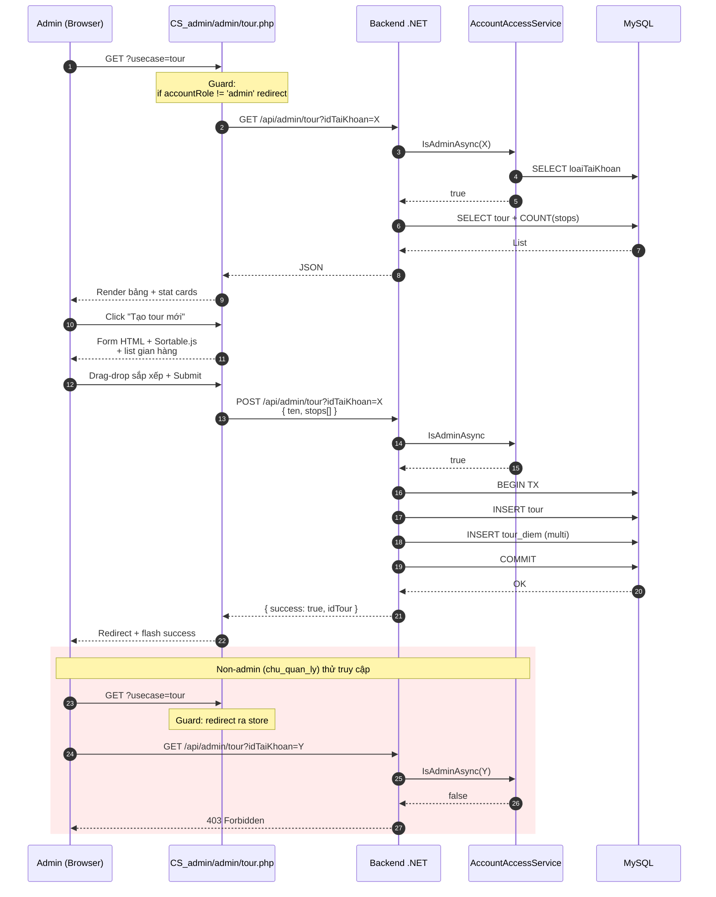
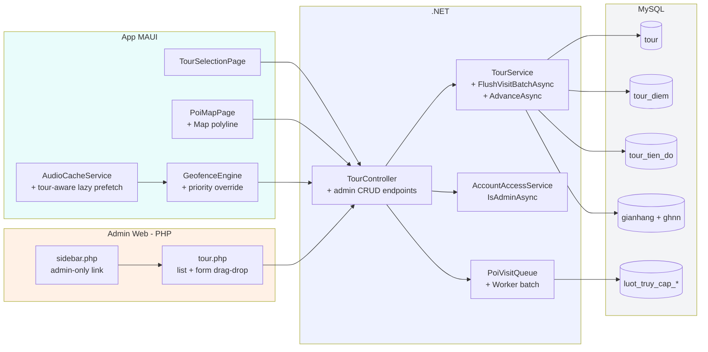

# Tour Flow Diagrams

Các sơ đồ Mermaid dưới đây có thể paste trực tiếp vào draw.io qua menu **Arrange > Insert > Advanced > Mermaid** (hoặc dùng plugin Mermaid trong VS Code/Notion).

---

## 1. Sequence — du khách đi 1 tour từ đầu đến cuối

---

## 2. State machine — trạng thái tour của 1 thiết bị

---

## 3. Priority logic — khi nào tour stop thắng audio

---

## 4. Admin CRUD flow

---

## 5. Tổng quan kiến trúc tour

